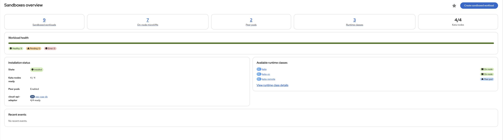
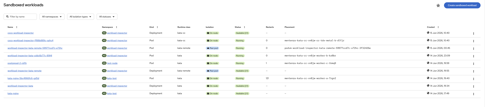
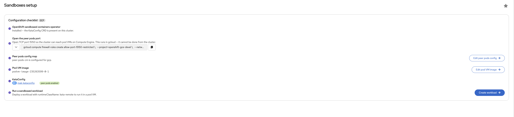
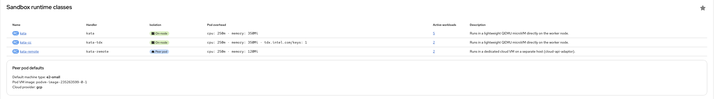

# OpenShift Sandboxed Containers console plugin (`osc-openshift-console-plugin`)

[](https://github.com/makentenza/osc-openshift-console-plugin/actions/workflows/build-push.yml)

> [!WARNING]
> **Unofficial and unsupported.** This is a community/personal project — **not** an official Red Hat
> or OpenShift product, and **not** covered by Red Hat support, subscriptions, or any SLA. It is
> provided **as-is** under the Apache-2.0 license. Validate in a
> non-production environment before use, at your own risk.

An OpenShift Console **dynamic plugin** that adds a **Sandboxes** menu for managing and observing
[OpenShift sandboxed containers](https://github.com/openshift/sandboxed-containers-operator)
workloads — both on-node Kata microVMs (`kata`) and peer pods (`kata-remote`):

- **Overview** — KataConfig install health, cloud-api-adaptor status, runtime classes, and
  workload counts split by isolation type.
- **Workloads** — every Pod/Deployment on a kata runtime class, with an isolation badge
  (on-node vs peer pod), status, and placement (node name, or the backing cloud VM `instanceID`
  resolved from the `PeerPod` CR). Create and delete from here.
- **Create wizard** — pick a runtime class (cards describe each isolation type), build a Pod or
  Deployment with a peer-pod machine-type override and a manifest preview.
- **Workload detail** — isolation, backing infrastructure, and live CPU/memory metrics.
- **Runtime classes** — reference view of the kata runtime classes and peer-pod defaults.

The whole menu is gated behind a `console.flag/model` flag on the `KataConfig` CRD, so it only
appears when OpenShift sandboxed containers is installed. Data is 100% Kubernetes API — no cloud
provider credentials required.

## Screenshots

### Overview


### Workloads


### Setup


### Runtime classes


## Stack

OCP **4.22**: React 18, PatternFly 6.4, `@openshift-console/dynamic-plugin-sdk` `4.22-latest`,
`react-router` v7, `swc-loader`, Yarn 4.14.1. Match the cluster's console version — the 4.22 SDK
emits the federation protocol the 4.22 console expects (4.21 consoles use a different protocol).

## Packaging

In production this plugin is **shipped by the OpenShift sandboxed containers (OSC) operator** —
there is no separate "install the plugin" step; the **Sandboxes** menu appears once the operator
registers the ConsolePlugin and the `KataConfig` CRD exists. Across the sandboxing/confidential
stack there are **two operators total**: the OSC operator ships this plugin *and* the Confidential
Containers plugin (one feature-gated operator — there is no separate CoCo operator), while a
separate **Trustee operator** ships the Confidential Attestation plugin.

## Develop

```bash
yarn install
yarn start          # plugin dev server on :9001
yarn start-console  # OpenShift console in a container (requires `oc login`)
# open http://localhost:9000/sandboxes
```

- `yarn lint` — eslint + prettier + stylelint (`--fix`)
- `yarn build` — production bundle
- `yarn i18n` — regenerate `locales/en/plugin__osc-openshift-console-plugin.json`

On Apple silicon with podman, `yarn start-console` runs an amd64 image; if it fails, enable
`qemu-user-static` (`podman machine ssh` → `sudo rpm-ostree install qemu-user-static` → reboot).

## Deploy

Build and push an image, then install the Helm chart — or use `./deploy.sh` to build, push, and
roll out in one step:

```bash
helm upgrade -i osc-openshift-console-plugin charts/openshift-console-plugin \
  -n <namespace> --create-namespace --set plugin.image=<image>
```

## Conventions

- i18n namespace `plugin__osc-openshift-console-plugin`; CSS class prefix `osc-openshift-console-plugin__`.
- PatternFly `--pf-t--*` semantic tokens only — **no hex/named colors** (stylelint enforces this to
  keep dark mode working).
- No naked element selectors or `.pf-` / `.co-` prefixed classes — they would clobber console styles.
- Functional components; hooks in `src/k8s/hooks.ts` wrap `useK8sWatchResource`; resource types
  extend `K8sResourceCommon`.

## References

- [Console dynamic plugin SDK](https://github.com/openshift/console/tree/main/frontend/packages/console-dynamic-plugin-sdk)
- [Dynamic plugin enhancement proposal](https://github.com/openshift/enhancements/blob/master/enhancements/console/dynamic-plugins.md)
